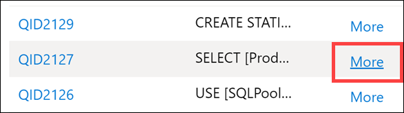
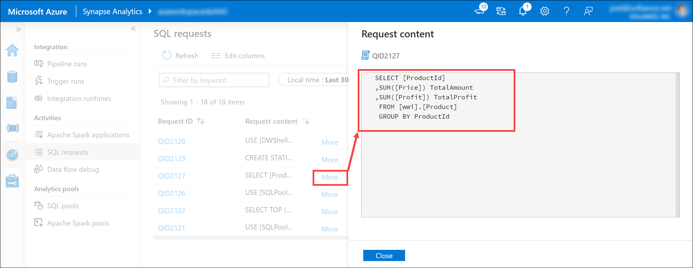

# Realize Integrated Analytical Solutions with Azure Synapse Analytics

In this demo, we show the primary features of Azure Synapse Analytics, and how they can be used to build a Modern Data Warehouse solution. The following table of contents describes and links to the elements of the demo:

- [Realize Integrated Analytical Solutions with Azure Synapse Analytics](#realize-integrated-analytical-solutions-with-azure-synapse-analytics)
  - [Demo prerequisites](#demo-prerequisites)
  - [About Azure Synapse Analytics](#about-azure-synapse-analytics)
  - [Surveying the Components of Azure Synapse Analytics](#surveying-the-components-of-azure-synapse-analytics)
  - [Exploring Azure Synapse Studio](#exploring-azure-synapse-studio)
    - [The Data hub](#the-data-hub)
    - [The Develop hub](#the-develop-hub)
    - [The Orchestrate hub](#the-orchestrate-hub)
    - [The Monitor hub](#the-monitor-hub)
    - [The Manage hub](#the-manage-hub)
  - [Designing a Modern Data Warehouse using Azure Synapse Analytics](#designing-a-modern-data-warehouse-using-azure-synapse-analytics)
    - [One place for all your data](#one-place-for-all-your-data)
    - [Unlimited data scale](#unlimited-data-scale)
    - [Familiar tools and ecosystem](#familiar-tools-and-ecosystem)
    - [Modern data warehouse processes](#modern-data-warehouse-processes)
      - [Stage 1: Data ingest and preparation](#stage-1-data-ingest-and-preparation)
      - [Stage 2: Model & serve](#stage-2-model--serve)
      - [Stage 3: Visualize](#stage-3-visualize)

## Demo prerequisites

1. An Azure Account with the ability to create an Azure Synapse Workspace
2. Make sure the following resource providers are registered for your Azure Subscription.  

   - Microsoft.Sql
   - Microsoft.Synapse
   - Microsoft.StreamAnalytics
   - Microsoft.EventHub  

    See [further documentation](https://docs.microsoft.com/en-us/azure/azure-resource-manager/management/resource-providers-and-types#azure-portal) for more information on registering resource providers on the Azure Portal.

3. A Power BI Pro or Premium account to host Power BI reports, dashboards, and configuration of streaming datasets.
4. Complete the [environment setup instructions](https://github.com/solliancenet/synapse-in-a-day-deployment) (external link).

## About Azure Synapse Analytics

Azure Synapse is an end-to-end analytics platform which combines SQL data warehousing, big data analytics, and data integration into a single integrated environment.

Synapse empowers users to gain quick access and insights across all of their data, enabling a whole new level of performance and scale that is simply unmatched in the industry.

As you will see here in our workspace, Synapse brings all of our data into a single service. Synapse does not just remove the silos between people in the organization, it also brings the data closer together.

## Surveying the Components of Azure Synapse Analytics

1. Start with the Azure resource group, `synapse-in-a-day-demos`.

    

    > The Azure Synapse Analytics components are highlighted in the screenshot above.

    When you deploy Azure Synapse Analytics, there are a few resources that deploy along with it, including the Azure Synapse Workspace and an Azure Data Lake Storage Gen2 (ADLS Gen2) account that acts as the primary storage for the workspace.

    In this example, we have a retail customer that uses Synapse Analytics as the central piece of a modern data warehouse. They ingest data from various sources, cleanse, transform, and analyze the data, train machine learning models, and create various reports. We will show these other related components alongside the Synapse Analytics components as a point of reference, but will focus on Synapse for now.

2. Open the **Synapse workspace** by selecting the item in the resource group.

    

    The Synapse workspace portal resource contains links to configure your workspace, manage access through Access control (IAM), firewalls, managed identities, and private endpoint connections, and view metrics. It also contains important information about your Synapse Analytics environment, such as:

    1. The **Primary ADLS Gen2 account URL (1)**, which identifies the primary data lake storage account.
    2. The **SQL endpoint** and **SQL on-demand endpoint (2)**, which are used to integrate with external tools, such as SQL Server Management Studio (SSMS), Azure Data Studio, and Power BI.
    3. The **Workspace web URL (3)**, a direct link to Synapse Studio for the workspace.
    4. Available resources, such as **SQL pools** and **Apache Spark pools (4)**.

3. Select the **SQL pool**.

    

    The SQL pool is shown below with the `Essentials` portion of the Overview blade collapsed.

    

    The SQL pool refers to the enterprise data warehousing features formerly provided by SQL Data Warehouse. It represents a collection of analytic resources that are provisioned when using Synapse SQL, vs. on-demand, provided by SQL serverless. The size of SQL pool is determined by Data Warehousing Units (DWU).

    You can access the SQL pool in the portal, as shown here, or from within Synapse Studio, as we'll show you in a bit. When you access SQL pool in the portal, you have configurations and controls not available to you from Synapse Studio. Here are some of the common features you'll access through the portal:

    1. At the top of the window, we see **controls (1)** to pause, scale, restore, set a new restore point, and delete the pool.
    2. Below, **Transparent data encryption (2)** is prominently displayed, letting us quickly see whether it is enabled to encrypt our databases, backups, and logs.
    3. Next to that, we see the **Geo-backup (3)** option and whether it is enabled to backup once per day to a paired data center.
    4. At the bottom of the Overview blade, we see metrics showing the **Data Warehousing Units (DWU) usage** and **Active and queued queries (4)**, allowing us to filter within different time ranges.
    5. The left-hand menu includes some of these options, as well. It is here where you find the **Access control (IAM) (5)** settings to control access to the SQL pool, granted to users and services.

4. Close the SQL pool and open the **Spark pool**.

    

    The Spark pool is shown below.

    

    Apache Spark is a parallel processing framework that supports in-memory processing to boost the performance of big-data analytic applications. Apache Spark in Azure Synapse Analytics is one of Microsoft's implementations of Apache Spark in the cloud. Azure Synapse makes it easy to create and configure a Spark pool in Azure, which is compatible with Azure Storage and Azure Data Lake Storage Gen2. Apache Spark in Azure Synapse supports workloads for data engineers, data analysts, and data scientists.

    Most of the options we see here are also available from within Synapse Studio, including:

    1. Configuring **auto-pause settings**, based on cluster idle time, and **auto-scale settings (1)** based on the amount of activity.
    2. The **Packages (2)** option allows you to upload an environment configuration file (output from the `pip freeze` command) that defines the Python packages to load on the cluster. The packages listed in this file for install or upgrade are downloaded from PyPi at the time of pool startup. This requirements file is used every time a Spark instance is created from that Spark pool.

    On the left-hand menu, you can also find the **Access control (IAM) (3)** settings to control access to the Spark pool, granted to users and services.

5. Select **Packages** on the left-hand menu of the Spark pool.

    

    When you select **Packages (1)** on the left-hand menu, you can view whether a `requirements.txt` file has been added to manage Python packages for Spark instances. You can **upload an environment config file (2)**, or select the ellipses (...) to the **right-hand side of a package file (3)** to access options to re-upload, download, or delete the file.

## Exploring Azure Synapse Studio

1. Open Synapse workspace in the resource group, then select either **Launch Synapse Studio** or the **Workspace web URL**.

    

    Synapse Studio is where you manage your workspace, explore data, create data movement pipelines, write T-SQL scripts, create and run Synapse Spark notebooks, build mapping data flows, create reports, and monitor your environment.

    Most of your work will be done here.

### The Data hub

1. Select the **Data** hub.

    

    The Data hub is where you access your provisioned SQL pool databases and SQL serverless databases in your workspace, as well as external data sources, such as storage accounts and other linked services.

2. Under the **Workspace (2)** tab of the Data hub (1), expand the **SQLPool01 (3)** SQL pool underneath **Databases**.

    

    > **Note**: The SQL pool must be running before you can display its tables.

3. Expand **Tables** and **Programmability/Stored procedures**.

    The **tables** listed under the SQL pool store data from multiple sources, such as SAP Hana, Twitter, Azure SQL Database, and external files copied over from an orchestration pipeline. Synapse Analytics gives us the ability to combine these data sources for analytics and reporting, all in one location.

    You will also see familiar database components, such as **stored procedures**. You can execute the stored procedures using T-SQL scripts, or execute them as part of an orchestration pipeline.

4. Select the **Linked** tab, expand the **Azure Data Lake Storage Gen2** group, then expand the **primary storage** for the workspace.

    

    Every Synapse workspace has a primary ADLS Gen2 account associated with it. This serves as the **data lake**, which is a great place to store flat files, such as files copied over from on-premises data stores, exported data or data copied directly from external services and applications, telemetry data, etc. *Everything is in one place*.

    In our example, we have several containers that hold files and folders that we can explore and use from within our workspace. Here you can see marketing campaign data, CSV files, finance information imported from an external database, machine learning assets, IoT device telemetry, SAP Hana data, and tweets, just to name a few.

    Now that we have all this data in once place, we can start previewing some of it right here, right now.

    Let's look at Campaign data.

5. Select the **customcsv** storage container.

    

    Let’s preview Campaign data to understand new campaign names.

6. Right-click on the **CampaignAnalyticsLatest.csv** file **(1)**, then select **Preview (2)**.

    

    The file explorer capabilities allow you to quickly find files and perform actions on them, like preview file contents, generate new SQL scripts or notebooks to access the file, create a new data flow or dataset, and manage the file.

    *Notice all the new Campaign names.*

    

### The Develop hub

1. Select the **Develop** hub.

    

    The Develop hub is where you manage SQL scripts, Synapse notebooks, data flows, and Power BI reports.

2. Expand each of the groups under the Develop menu.

    

    The Develop hub in our sample environment contains examples of the following artifacts:

    1. **SQL scripts** contains T-SQL scripts that you publish to your workspace. Within the scripts, you can execute commands against any of the provisioned SQL pools or on-demand SQL serverless pools to which you have access.
    2. **Notebooks** contains Synapse Spark notebooks used for data engineering and data science tasks. When you execute a notebook, you select a Spark pool as its compute target.
    3. **Data flows** are powerful data transformation workflows that use the power of Apache Spark, but are authored using a code-free GUI.
    4. **Power BI** reports can be embedded here, giving you access to the advanced visualizations they provide without ever leaving the Synapse workspace.

### The Orchestrate hub

1. Select the **Orchestrate** hub.

    

    Manage orchestration pipelines within the Orchestrate hub. If you are familiar with Azure Data Factory, then you will feel at home in this hub. The pipeline creation experience is the same as in ADF, which gives you another powerful integration built in to Synapse Analytics, removing the need to use Azure Data Factory for data movement and transformation pipelines.

2. Expand Pipelines and select **1 Master Pipeline (1)**. Point out the **Activities (2)** that can be added to the pipeline, and show the **pipeline canvas (3)** on the right.

    

    Our Synapse workspace contains 16 pipelines that enable us to orchestrate data movement and transformation steps over data from several sources.

    The **Activities** list contains a large number of activities that you can drag and drop onto the pipeline canvas on the right.

    > Expand a few activity categories to show what's available, such as Notebook, Spark, and SQL pool stored procedure activities under Synapse.

### The Monitor hub

1. Select the **Monitor** hub.

    

    Use the Monitor hub to view pipeline and trigger runs, integration runtime status, Apache Spark jobs, SQL requests, and data flow debug activities. If you want to see the status of a job or activity, this is where you want to go.

    The Monitor hub is your first stop for debugging issues and gaining insight on resource usage. You can see a history of all the activities taking place in the workspace and which ones are active now.

2. Show each of the monitoring categories grouped under Orchestration and Activities.

    

    1. **Pipeline runs** shows all pipeline run activities. You can view the run details, including inputs and outputs for the activities, and any error messages that occurred. You can also come here to stop a pipeline, if needed.
    2. **Trigger runs** shows you all pipeline runs caused by automated triggers. You can create triggers that run on a recurring schedule or tumbling window. You can also create event-based triggers that execute a pipeline any time a blob is created or deleted in a storage container.
    3. **Integration runtimes** shows the status of all self-hosted and Azure integration runtimes.
    4. **Apache Spark applications** shows all the Spark applications that are running or have run in your workspace.
    5. **SQL requests** shows all SQL scripts executed either directly by you or another user, or executed in other ways, like from a pipeline run.
    6. **Data flow debug** shows active and previous debug sessions. When you author a data flow, you can enable the debugger and execute the data flow without needing to add it to a pipeline and trigger an execute. Using the debugger speeds up and simplifies the development process. Since the debugger requires an active Spark cluster, it can take a few minutes after you enable the debugger before you can use it.

3. Select **SQL requests (1)**, then switch to the **SQLPool01 (2)** pool to see the list of SQL requests.

    

4. Hover over a SQL request, then select the **Request content** icon to view the SQL request that was sent to the SQL pool. *You may need to try a few before you find one with interesting content*.

    

    

### The Manage hub

1. Select the **Manage** hub.

    

    The Manage hub enables you to perform some of the same actions we saw in the Azure portal, such as managing SQL and Spark pools. However, there is a lot more you can do in this hub that you cannot do anywhere else, such as managing Linked Services and integration runtimes, and creating pipeline triggers.

2. Show each of the management categories grouped under Analytics pools, External connections, Orchestration, and Security.

    

    1. **SQL pools** lists the provisioned SQL pools and on-demand SQL serverless pools for the workspace. You can can add new pools or hover over a SQL pool to **pause** or **scale** it. You should pause a SQL pool when it's not being used in order to save costs.
    2. **Apache Spark pools** lets you manage your Spark pools by configuring the auto-pause and auto-scale settings. You can provision a new Apache Spark pool from this blade.
    3. **Linked services** enables you to manage connections to external resources. Here you can see linked services for our data lake storage account, Azure Key Vault, Power BI, and Synapse Analytics. **Task**: Select **+ New** to show how many types of linked services you can add.
    4. **Triggers** provides you a central location to create or remove pipeline triggers. Alternatively, you can add triggers from the pipeline.
    5. **Integration runtimes** lists the IR for the workspace, which serve as the compute infrastructure for data integration capabilities, like those provided by pipelines. **Task**: Hover over the integration runtimes to show the monitoring, code, and delete (if applicable) links. Click on a **code link** to show how you can modify the parameters in JSON format, including the TTL (time to live) setting for the IR.
    6. **Access control** is where you go to add and remove users to one of three security groups: workspace admin, SQL admin, and Apache Spark for Azure Synapse Analytics admin.
    7. **Managed private endpoints** is where you manage private endpoints, which use a private IP address from within a virtual network to connect to an Azure service or your own private link service. Connections using private endpoints listed here provide access to Synapse workspace endpoints (SQL, SqlOndemand and Dev).

## Designing a Modern Data Warehouse using Azure Synapse Analytics

### One place for all your data

With a modern data warehouse, we have one hub for all data when using Synapse Analytics.

Synapse Analytics enables you to ingest data from multiple data sources through its orchestration pipelines.

1. Select the **Orchestrate** hub.

    

    Manage orchestration pipelines within the Orchestrate hub. If you are familiar with Azure Data Factory, then you will feel at home in this hub. The pipeline creation experience is the same as in ADF, which gives you another powerful integration built in to Synapse Analytics, removing the need to use Azure Data Factory for data movement and transformation pipelines.

2. Expand Pipelines and select **Customize EMail Analytics (1)**. Select the **Copy data** activity on the canvas **(2)**, select the **Source** tab **(3)**, then select **Preview data (4)**.

    

    Here we see the source CSV data that the pipeline ingests.

    

3. Close the preview, then select **Open** next to the `CustomEmailAnalytics` source dataset.

    

4. Show the **Linked service** associated with the dataset's connection, as well as the CSV file path **(1)**. **Close (2)** the dataset to return to the pipeline.

    

5. On the pipeline, select the **Sink** tab **(1)**. The bulk insert copy method is selected and there is a pre-copy script that truncates the `EmailAnalytics` table, which runs prior to copying the data from the CSV source **(2)**. Select **Open** next to the `EmailAnalytics` sink dataset **(3)**.

    

6. The **Linked service** is the Azure Synapse Analytics SQL pool, and the **Table** is `EmailAnalytics` **(1)**. The Copy data activity in the pipeline uses the connection details in this dataset to copy data from the CSV data source into the SQL pool. Select **Preview data (2)**.

    

    We can see that the table already contains data, which means that we have successfully run the pipeline in the past.

    

7. **Close** the `EmailAnalytics` dataset.

    

8. Select the **Mapping** tab. This is where you configure the mapping between the source and sink datasets. The **Import schemas** button attempts to infer the schema for your datasets if they are based on unstructured or semi-structured data sources, like CSV or JSON files. It also reads the schema from structured data sources, like Synapse Analytics SQL pools. You also have the option to manually create your schema mapping by clicking on **+ New mapping** or by modifying the data types.

    

9. Select the **MarketingDBMigration (1)** pipeline. Direct your attention to the pipeline's canvas **(2)**.

    

    This pipeline is responsible for copying data from a Teradata database. The first activity is a **lookup** **(2)** to make sure that the source data exists. If data exists, it flows to the **copy data activity** **(3)** to move the source data into the data lake (ADLS Gen2 primary data source). The next step is a **Notebook activity** **(4)**, which uses Apache Spark within a Synapse Notebook to perform data engineering tasks. The last step is another **copy data activity** **(5)** that loads the prepared data and stores it into an Azure Synapse SQL pool table.

    This workflow is common when conducting data movement orchestration. Synapse Analytics pipelines makes it easy to define data movement and transformation steps, and encapsulates these steps into a repeatable process that you can maintain and monitor within your modern data warehouse.

10. Select the **SalesDBMigration (1)** pipeline. Direct your attention to the pipeline's canvas **(2)**.

    

    Here is another example of a data movement orchestration pipeline that helps us combine external data sources into our warehouse. In this case, we load data from an Oracle sales database into an Azyre Synapse SQL pool table.

11. Select the **SAP HANA TO ADLS** pipeline. This pipeline copies data from a financial SAP HANA data source into the SQL pool.

12. Select the **+** button at the top of the **Orchestrate** blade, then select **Pipeline** to create a new pipeline.

    

13. Expand the `Move & transform` activity group, then drag the **Copy data** activity onto the design canvas **(1)**. With the Copy data activity selected, select the **Source** tab **(2)**, then select **+ New (3)** next to the source dataset.

    

14. Scroll through the list of dataset sources to show the large number of data connections at your disposal.

    

### Unlimited data scale

1. Select the **Manage** hub.

    

2. Select **SQL pools (1)**. Hover over **SQLPool01** and select the **Scale** button **(2)**.

    

3. Drag the **Performance level** slider right and left.

    

    You can scale out or back compute by adjusting the number of Data Warehouse Units (DWUs) assigned to your SQL pool. This adjusts the loading and query performance linearly as you add more units.

    To perform a scale operation, SQL pool first kills all incoming queries and then rolls back transactions to ensure a consistent state. Scaling only occurs once the transaction rollback is complete.

    You can scale SQL compute at any time by using this slider. You can also programmatically adjust the Data Warehouse Units, enabling scenarios where you automatically scale your pool based on a schedule or other factors.

4. Cancel the Scale dialog, then select **Apache Spark pools (1)** in the Manage hub left-hand menu. Hover over **SparkPool01** and select the **auto-scale settings** button **(2)**.

    

5. Drag the **Number of nodes** slider right and left.

    

    You can configure the Apache Spark pool to have a fixed size by disabling the autoscale setting. Here we have enabled autoscale and set the minimum and maximum number of nodes to control the amount of scale applied. When you enable autoscale, Synapse Analytics monitors the resource requirements of the load and scales the number of nodes up or down. It does this by continuously monitoring pending CPU, pending memory, free CPU, free memory, and used memory per node metrics. It checks these metrics every 30 seconds and makes scaling decisions based on the values.

    > It can take 1-5 minutes for a scaling operation to complete.

6. Cancel the auto-scale dialog, then select **Linked services (1)** in the Manage hub left-hand menu. Make note of the **WorkspaceDefaultStorage** ADLS Gen2 storage account **(2)**.

    

    When you provision a new Azure Synapse Analytics workspace, you define the default storage Azure Data Lake Storage Gen2 account. Data Lake Storage Gen2 makes Azure Storage the foundation for building enterprise data lakes on Azure. Designed from the start to service multiple petabytes of information while sustaining hundreds of gigabits of throughput, Data Lake Storage Gen2 allows you to easily manage massive amounts of data.

    Its hierarchical namespace organizes files into a hierarchy of directories for efficient access and more granular security, down to the file-level.

    > ADLS Gen2 provides virtually limitless scale for your data lake. You can attach additional ADLS Gen2 accounts for greater scale and flexibility as needed.

### Familiar tools and ecosystem

1. Select the **Develop** hub.

    

2. Expand **SQL scripts** and select **1 SQL Query With Synapse (1)**. Make sure you are connected to **SQLPool01 (2)**. **Highlight (3)** the first line of the script and execute. Observe that the number of records in the Sales table is 3,443,486 **(4)**.

    

    If we execute the first line in this SQL script, we can see that we have almost 3.5 million rows contained within.

3. **Highlight** the rest of the script (lines 8 - 18) and execute.

    

    One of the benefits of using a modern data warehouse like Synapse Analytics is that you can combine all your data in one place. The script we just executed joins data from a sales database, product catalog, millennial customers extracted from demographics data, and twitter.

4. Select the **2 JSON Extractor (1)** script and make sure you're still connected to **SQLPool01**. Highlight the **first select statement (2)** (line 3). Observe that the data stored in the **TwitterData** column **(3)** is in JSON format.

    

    Azure Synapse enables you to store JSON in standard textual format. Use standard SQL language for querying JSON data.

5. Highlight the next SQL statement (**lines 8 - 15**) and execute.

    

    We can use JSON functions, such as `JSON_VALUE` and `ISJSON` to extract the JSON data and extract it to specific structured columns.

6. Highlight the next SQL statement (**lines 21 - 29**) and execute.

    

    We want to filter for the **#sunglassess** hashtag. This query fetches and extracts the JSON data into structured columns, then filters on the derived `Hashtag` column.

    > **Note**: The last script does the same thing, but just using a subquery format.

7. Select the **8 External Data To Synapse Via Copy Into (1)** script. **DO NOT EXECUTE**. Scroll through the script file, using the commentary below to explain what it does.

    

    In this script, we create a table to store Twitter data stored in Parquet files. We use the **COPY** command to quickly and efficiently load all data stored in Parquet files into the new table.

    Finally, we select the first 10 rows to verify the data load.

    The COPY command and PolyBase can be used to import data from various formats into the SQL pool, either through T-SQL scripts like we see here, or from orchestration pipelines.

8. Select the **Data** hub.

    

9. Select the **Linked** tab **(1)**, expand the `Azure Data Lake Storage Gen2` group, expand the Primary storage account, then select the **twitterdata** container **(2)**. Right-click on the **dbo.TwitterAnalytics.parquet** file **(3)**, then select **New notebook (4)**.

    

    Synapse Studio provides several options to work with files stored in attached storage accounts, such as creating a new SQL script, a notebook, data flow, or new dataset.

    Synapse Notebooks enable you to harness the power of Apache Spark to explore and analyze data, conduct data engineering tasks, and do data science. Authentication and authorization with linked services, such as the primary data lake storage account, are fully integrated, allowing you to immediately start working with files without dealing with account credentials.

    Here we see a new notebook that loads a Spark DataFrame **(1)** with the Parquet file that we right-clicked on in the Data hub. We can immediately start exploring the file contents in just a couple simple steps. At the top of the notebook, we see that it is attached to **SparkPool01**, our Spark pool, and the notebook language is set to **Python (2)**.

    > **Note to presenter**: Do not execute the notebook unless the Spark pool is ready **(3)**. It can take up to 5 minutes to start the pool if it is idle. Alternatively, you can execute the notebook, then come back to it later to view the results.

    

### Modern data warehouse processes

#### Stage 1: Data ingest and preparation

1. Select the **Orchestrate** hub.

    

2. Expand Pipelines and select **1 Master Pipeline (1)**. Point out the **Activities (2)** that can be added to the pipeline, and show the **pipeline canvas (3)** on the right.

    

    Our Synapse workspace contains 16 pipelines that enable us to orchestrate data movement and transformation steps over data from several sources.

    The **Activities** list contains a large number of activities that you can drag and drop onto the pipeline canvas on the right.

    Here we see that we have three execute (child) pipelines:

    

3. Select the **Execute Customize All Pipeline** activity **(1)**. Select the **Settings (2)** tab. Show that the invoked pipeline is **Customize All (3)**, then select **Open (4)**.

    

    As you can see, there are five child pipelines. This **first execute pipeline activity** cleans and ingests new Manufacturer campaign data for the Campaign Analytics report.

4. Select the **Campaign Analytics** activity **(1)**, select the **Settings** tab **(2)**, observe the invoked pipeline is set to **Customize All (3)**, then select **Open (4)**.

    

5. **Observe** how cleaning and ingesting happens in the pipeline by clicking on each activity.

    

6. Select the **Develop** hub.

    

7. Expand `Data flows`, then select the **ingest_data_from_sap_hana_to_azure_synapse** data flow.

    

    As stated earlier, data flows are powerful data transformation workflows that use the power of Apache Spark, but are authored using a code-free GUI. The work you do in the UI gets transformed into code executed by a managed Spark cluster, automatically, without having to write any code or manage the cluster.

    > **Note to presenter**: Select each data flow item as you speak to the points below.

    The data flow performs the following functions:

    1. Extracts data from the SAP HANA data source (**Select `DatafromSAPHANA` step**).
    2. Retrieves only those rows for an upsert activity, where the `ShipDate` value is greater than `2014-01-01` (**Select `Last5YearsData` step**).
    3. Performs data type transformations on the source columns, using a Derived Column activity (**Select the top `DerivedColumn` activity**).
    4. In the top path of the data flow, we select all columns, then load the data into the `AggregatedSales_SAPHANANew` Synapse pool table (**Select the `Selectallcolumns` activity and the `LoadtoAzureSynapse` activity**).
    5. In the bottom path of the data flow, we select a subset of the columns (**Select the `SelectRequiredColumns` activity**).
    6. Then we group by four of the columns (**Select the `TotalSalesByYearMonthDay` activity**) and create sum and average aggregates on the `SalesAmount` column (**Select the Aggregates option**).
    7. Finally, the aggregated data is loaded into the `AggregatedSales_SAPHANA` Synapse pool table (**Select the `LoadtoSynapse` activity**).

#### Stage 2: Model & serve

1. Select the **Develop** hub.

    

2. Expand `Notebooks`, then select **1 Products Recommendation**.

    

    This Synapse Notebook provides customized product recommendations.

    > **Note to presenter**: This notebook contains cell outputs from a previous run. You can read through the output and explain what the notebook does by reading the prompts below.

    1. Data is ingested from CSV files using PySpark (**cell 4**).

    2. The model is trained using the PySpark ML-Lib recommendations module (**cells 7 & 8**).

    3. Product recommendations are generated for each user (**cells 9-12**).

3. Select the **2 AutoML Number of Customer Visit to Department** notebook.

    

    This uses Azure Machine Learning's AutoML feature to predict the number of customers likely to visit different departments in a store.

    > **Note to presenter**: This notebook contains cell outputs from a previous run. You can read through the output and explain what the notebook does by reading the prompts below.

    1. Data is ingested from CSV files using PySpark (**cell 7**).

    2. We use exploratory data analysis to understand the underlying patterns and correlations among features in the data (**cells 9-12**).

    3. Prepare the data by converting date fields to a specific format, and other data types to numeric format (**cells 14 & 15**).

    4. Configure AutoML using `AutoMLConfig` and create a new experiment in the Azure Machine Learning workspace (**cells 19-21**).

    5. Remotely run the experiment to train the model with more than 25 ML algorithms, grading each according to performance. We create a time-series model with lag and rolling window features (**cells 23 * 24**).

    6. Run and explore the forecast, then register the model (**cells 26-29**).

#### Stage 3: Visualize

1. Select the **Develop** hub.

    

2. Expand `Power BI`, expand `SynapseDemos`, expand `Power BI reports`, then select **1-CDP Vision Demo (1)**. Select the arrows to collapse the **Visualizations** pane **(2)** and the **Fields** pane **(3)** to increase the report size.

    

    As you can see, we can create, edit, and view Power BI reports from within Synapse Studio! As a business analyst, data engineer, or developer, you no longer need to open another browser window, sign in to Power BI, and toggle back and forth between environments.

3. Select a **Campaign Name** and **Region** within the **Decomposition Tree Analysis** tab to explore the data. If you hover over an item, you will see a tool tip.

    

4. Select the **Campaign Analytics** tab at the bottom of the report.

    

    The Campaign Analytics report combines data from the various data sources we looked at today to create a compelling visualization of valuable data within an interactive interface.

    > **Note to presenter**: Select various filters, campaigns, and chart values to filter the results. Select an item to for the second time to deselect it.

    

5. Select **Power BI datasets (1)** in the left-hand menu, hover over the **2-Billion Rows Demo** dataset and select the **New Power BI report** icon **(2)**.

    

    Here is how we can create a brand new Power BI report from a dataset that is part of the linked Power BI workspace, from within Synapse Studio.

6. Expand the `Category` table, then **drag-and-drop** the **Category** field on to the report canvas. This creates a new Table visualization that shows the categories.

    

7. Select a blank area on the report canvas to deselect the table, then select the **Pie chart** visualization.

    

8. Expand the `ProdChamp` table. Drag **Campaign** onto the **Legend** field, then drag **ProductID** onto the **Values** field. Resize the pie chart and hover over the pie slices to see the tool tips.

    

    We have very quickly created a new Power BI report, using data stored within our Synapse Analytics workspace, without ever leaving the studio.

    As you can see, the goal, and one of the primary strengths of Azure Synapse Analytics, is to help you build a modern data warehouse and have access to all of your data in one place.
