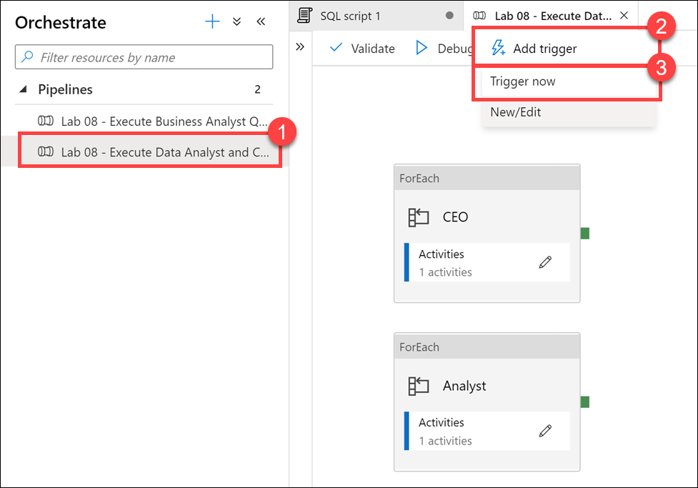
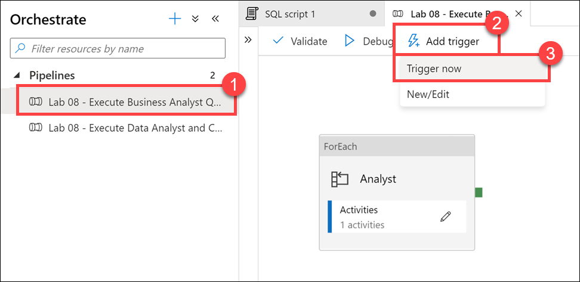

# Optimize a Data Warehouse with Azure Synapse SQL Pools

In this demo, we show ways you can optimize data warehouse workloads that use the provisioned SQL pools. We cover useful developer features, how to define and use workload management and classification to control data loading, and methods to optimize query performance. The following table of contents describes and links to the elements of the demo:

- [Optimize a Data Warehouse with Azure Synapse SQL Pools](#optimize-a-data-warehouse-with-azure-synapse-sql-pools)
  - [Understanding developer features of Azure Synapse Analytics](#understanding-developer-features-of-azure-synapse-analytics)
    - [Using windowing functions](#using-windowing-functions)
    - [Approximate execution using HyperLogLog functions](#approximate-execution-using-hyperloglog-functions)
  - [Using data loading best practices in Azure Synapse Analytics](#using-data-loading-best-practices-in-azure-synapse-analytics)
    - [Implement workload management](#implement-workload-management)
    - [Create a workload classifier to add importance to certain queries](#create-a-workload-classifier-to-add-importance-to-certain-queries)
    - [Reserve resources for specific workloads through workload isolation](#reserve-resources-for-specific-workloads-through-workload-isolation)
  - [Optimizing data warehouse query performance in Azure Synapse Analytics](#optimizing-data-warehouse-query-performance-in-azure-synapse-analytics)
    - [Identify performance issues related to tables](#identify-performance-issues-related-to-tables)
    - [Create hash distribution and columnstore index](#create-hash-distribution-and-columnstore-index)
    - [Improve table structure with partitioning](#improve-table-structure-with-partitioning)
    - [Use result set caching](#use-result-set-caching)

## Understanding developer features of Azure Synapse Analytics

### Using windowing functions

### Approximate execution using HyperLogLog functions

## Using data loading best practices in Azure Synapse Analytics

### Implement workload management

Running mixed workloads can pose resource challenges on busy systems. Solution Architects seek ways to separate classic data warehousing activities (such as loading, transforming, and querying data) to ensure that enough resources exist to hit SLAs.

Synapse SQL pool workload management in Azure Synapse consists of three high-level concepts: Workload Classification, Workload Importance and Workload Isolation. These capabilities give you more control over how your workload utilizes system resources.

Workload importance influences the order in which a request gets access to resources. On a busy system, a request with higher importance has first access to resources. Importance can also ensure ordered access to locks.

Workload isolation reserves resources for a workload group. Resources reserved in a workload group are held exclusively for that workload group to ensure execution. Workload groups also allow you to define the amount of resources that are assigned per request, much like resource classes do. Workload groups give you the ability to reserve or cap the amount of resources a set of requests can consume. Finally, workload groups are a mechanism to apply rules, such as query timeout, to requests.

### Create a workload classifier to add importance to certain queries

Tailwind Traders has asked you if there is a way to mark queries executed by the CEO as more important than others, so they don't appear slow due to heavy data loading or other workloads in the queue. You decide to create a workload classifier and add importance to prioritize the CEO's queries.

1. Select the **Develop** hub.

    

2. From the **Develop** menu, select the **+** button **(1)** and choose **SQL Script (2)** from the context menu.

    

3. In the toolbar menu, connect to the **SQL Pool** database to execute the query.

    

4. In the query window, replace the script with the following to confirm that there are no queries currently being run by users logged in as `asa.sql.workload01`, representing the CEO of the organization or `asa.sql.workload02` representing the data analyst working on the project:

    ```sql
    --First, let's confirm that there are no queries currently being run by users logged in workload01 or workload02

    SELECT s.login_name, r.[Status], r.Importance, submit_time, 
    start_time ,s.session_id FROM sys.dm_pdw_exec_sessions s 
    JOIN sys.dm_pdw_exec_requests r ON s.session_id = r.session_id
    WHERE s.login_name IN ('asa.sql.workload01','asa.sql.workload02') and Importance
    is not NULL AND r.[status] in ('Running','Suspended') 
    --and submit_time>dateadd(minute,-2,getdate())
    ORDER BY submit_time ,s.login_name
    ```

5. Select **Run** from the toolbar menu to execute the SQL command.

    

    Now that we have confirmed that there are no running queries, we need to flood the system with queries and see what happens for `asa.sql.workload01` and `asa.sql.workload02`. To do this, we'll run a Azure Synapse Pipeline which triggers queries.

6. Select the **Orchestrate** hub.

    

7. Select the **Lab 08 - Execute Data Analyst and CEO Queries** Pipeline **(1)**, which will run / trigger the `asa.sql.workload01` and `asa.sql.workload02` queries. Select **Add trigger (2)**, then **Trigger now (3)**. In the dialog that appears, select **OK**.

    

    > **Note to presenter**: Leave this tab open since you will come back to this pipeline again.

8. Let's see what happened to all the queries we just triggered as they flood the system. In the query window, replace the script with the following:

    ```sql
    SELECT s.login_name, r.[Status], r.Importance, submit_time, start_time ,s.session_id FROM sys.dm_pdw_exec_sessions s 
    JOIN sys.dm_pdw_exec_requests r ON s.session_id = r.session_id
    WHERE s.login_name IN ('asa.sql.workload01','asa.sql.workload02') and Importance
    is not NULL AND r.[status] in ('Running','Suspended') and submit_time>dateadd(minute,-2,getdate())
    ORDER BY submit_time ,status
    ```

9. Select **Run** from the toolbar menu to execute the SQL command.

    

    You should see an output similar to the following:

    

    > **Note to presenter**: This query could take over a minute to execute.

    Notice that the **Importance** level for all queries is set to **normal**.

10. We will give our `asa.sql.workload01` user queries priority by implementing the **Workload Importance** feature. In the query window, replace the script with the following:

    ```sql
    IF EXISTS (SELECT * FROM sys.workload_management_workload_classifiers WHERE name = 'CEO')
    BEGIN
        DROP WORKLOAD CLASSIFIER CEO;
    END
    CREATE WORKLOAD CLASSIFIER CEO
      WITH (WORKLOAD_GROUP = 'largerc'
      ,MEMBERNAME = 'asa.sql.workload01',IMPORTANCE = High);
    ```

    We are executing this script to create a new **Workload Classifier** named `CEO` that uses the `largerc` Workload Group and sets the **Importance** level of the queries to **High**.

11. Select **Run** from the toolbar menu to execute the SQL command.

    

12. Let's flood the system again with queries and see what happens this time for `asa.sql.workload01` and `asa.sql.workload02` queries. To do this, we'll run an Azure Synapse Pipeline which triggers queries. **Select** the `Orchestrate` Tab, **run** the **Lab 08 - Execute Data Analyst and CEO Queries** Pipeline, which will run / trigger the `asa.sql.workload01` and `asa.sql.workload02` queries.

13. In the query window, replace the script with the following to see what happens to the `asa.sql.workload01` queries this time:

    ```sql
    SELECT s.login_name, r.[Status], r.Importance, submit_time, start_time ,s.session_id FROM sys.dm_pdw_exec_sessions s 
    JOIN sys.dm_pdw_exec_requests r ON s.session_id = r.session_id
    WHERE s.login_name IN ('asa.sql.workload01','asa.sql.workload02') and Importance
    is not NULL AND r.[status] in ('Running','Suspended') and submit_time>dateadd(minute,-2,getdate())
    ORDER BY submit_time ,status desc
    ```

14. Select **Run** from the toolbar menu to execute the SQL command.

    

    You should see an output similar to the following:

    

    Notice that the queries executed by the `asa.sql.workload01` user have a **high** importance.

15. Select the **Monitor** hub.

    

16. Select **Pipeline runs (1)**, and then select **Cancel recursive (2)** for each running Lab 08 pipelines, marked **In progress (3)**. This will help speed up the remaining tasks.

    

### Reserve resources for specific workloads through workload isolation

Workload isolation means resources are reserved, exclusively, for a workload group. Workload groups are containers for a set of requests and are the basis for how workload management, including workload isolation, is configured on a system. A simple workload management configuration can manage data loads and user queries.

In the absence of workload isolation, requests operate in the shared pool of resources. Access to resources in the shared pool is not guaranteed and is assigned on an importance basis.

Given the workload requirements provided by Tailwind Traders, you decide to create a new workload group called `CEODemo` to reserve resources for queries executed by the CEO.

Let's start by experimenting with different parameters.

1. In the query window, replace the script with the following:

    ```sql
    IF NOT EXISTS (SELECT * FROM sys.workload_management_workload_groups where name = 'CEODemo')
    BEGIN
        Create WORKLOAD GROUP CEODemo WITH  
        ( MIN_PERCENTAGE_RESOURCE = 50        -- integer value
        ,REQUEST_MIN_RESOURCE_GRANT_PERCENT = 25 --  
        ,CAP_PERCENTAGE_RESOURCE = 100
        )
    END
    ```

    The script creates a workload group called `CEODemo` to reserve resources exclusively for the workload group. In this example, a workload group with a `MIN_PERCENTAGE_RESOURCE` set to 50% and `REQUEST_MIN_RESOURCE_GRANT_PERCENT` set to 25% is guaranteed 2 concurrency.

2. Select **Run** from the toolbar menu to execute the SQL command.

    

3. In the query window, replace the script with the following to create a Workload Classifier called `CEODreamDemo` that assigns a workload group and importance to incoming requests:

    ```sql
    IF NOT EXISTS (SELECT * FROM sys.workload_management_workload_classifiers where  name = 'CEODreamDemo')
    BEGIN
        Create Workload Classifier CEODreamDemo with
        ( Workload_Group ='CEODemo',MemberName='asa.sql.workload02',IMPORTANCE = BELOW_NORMAL);
    END
    ```

    This script sets the Importance to **BELOW_NORMAL** for the `asa.sql.workload02` user, through the new `CEODreamDemo` Workload Classifier.

4. Select **Run** from the toolbar menu to execute the SQL command.

    

5. In the query window, replace the script with the following to confirm that there are no active queries being run by `asa.sql.workload02` (suspended queries are OK):

    ```sql
    SELECT s.login_name, r.[Status], r.Importance, submit_time,
    start_time ,s.session_id FROM sys.dm_pdw_exec_sessions s
    JOIN sys.dm_pdw_exec_requests r ON s.session_id = r.session_id
    WHERE s.login_name IN ('asa.sql.workload02') and Importance
    is not NULL AND r.[status] in ('Running','Suspended')
    ORDER BY submit_time, status
    ```

6. Select **Run** from the toolbar menu to execute the SQL command.

    

7. Select the **Orchestrate** hub.

    

8. Select the **Lab 08 - Execute Business Analyst Queries** Pipeline **(1)**, which will run / trigger  `asa.sql.workload02` queries. Select **Add trigger (2)**, then **Trigger now (3)**. In the dialog that appears, select **OK**.

    

    > **Note to presenter**: Leave this tab open since you will come back to this pipeline again.

9. In the query window, replace the script with the following to see what happened to all the `asa.sql.workload02` queries we just triggered as they flood the system:

    ```sql
    SELECT s.login_name, r.[Status], r.Importance, submit_time,
    start_time ,s.session_id FROM sys.dm_pdw_exec_sessions s
    JOIN sys.dm_pdw_exec_requests r ON s.session_id = r.session_id
    WHERE s.login_name IN ('asa.sql.workload02') and Importance
    is not NULL AND r.[status] in ('Running','Suspended')
    ORDER BY submit_time, status
    ```

10. Select **Run** from the toolbar menu to execute the SQL command.

    

    You should see an output similar to the following that shows the importance for each session set to `below_normal`:

    

    Notice that the running scripts are executed by the `asa.sql.workload02` user **(1)** with an Importance level of **below_normal (2)**. We have successfully configured the business analyst queries to execute at a lower importance than the CEO queries. We can also see that the `CEODreamDemo` Workload Classifier works as expected.

11. Select the **Monitor** hub.

    

12. Select **Pipeline runs (1)**, and then select **Cancel recursive (2)** for each running Lab 08 pipelines, marked **In progress (3)**. This will help speed up the remaining tasks.

    

13. Return to the query window under the **Develop** hub. In the query window, replace the script with the following to set 3.25% minimum resources per request:

    ```sql
    IF  EXISTS (SELECT * FROM sys.workload_management_workload_classifiers where group_name = 'CEODemo')
    BEGIN
        Drop Workload Classifier CEODreamDemo
        DROP WORKLOAD GROUP CEODemo
        --- Creates a workload group 'CEODemo'.
            Create  WORKLOAD GROUP CEODemo WITH  
        (MIN_PERCENTAGE_RESOURCE = 26 -- integer value
            ,REQUEST_MIN_RESOURCE_GRANT_PERCENT = 3.25 -- factor of 26 (guaranteed more than 4 concurrencies)
        ,CAP_PERCENTAGE_RESOURCE = 100
        )
        --- Creates a workload Classifier 'CEODreamDemo'.
        Create Workload Classifier CEODreamDemo with
        (Workload_Group ='CEODemo',MemberName='asa.sql.workload02',IMPORTANCE = BELOW_NORMAL);
    END
    ```

    > **Note**: Configuring workload containment implicitly defines a maximum level of concurrency. With a CAP_PERCENTAGE_RESOURCE set to 60% and a REQUEST_MIN_RESOURCE_GRANT_PERCENT set to 1%, up to a 60-concurrency level is allowed for the workload group. Consider the method included below for determining the maximum concurrency:
    > 
    > [Max Concurrency] = [CAP_PERCENTAGE_RESOURCE] / [REQUEST_MIN_RESOURCE_GRANT_PERCENT]

14. Select **Run** from the toolbar menu to execute the SQL command.

    

15. Let's flood the system again and see what happens for `asa.sql.workload02`. To do this, we will run an Azure Synapse Pipeline which triggers queries. Select the `Orchestrate` Tab. **Run** the **Lab 08 - Execute Business Analyst Queries** Pipeline, which will run / trigger  `asa.sql.workload02` queries.

16. In the query window, replace the script with the following to see what happened to all of the `asa.sql.workload02` queries we just triggered as they flood the system:

    ```sql
    SELECT s.login_name, r.[Status], r.Importance, submit_time,
    start_time ,s.session_id FROM sys.dm_pdw_exec_sessions s
    JOIN sys.dm_pdw_exec_requests r ON s.session_id = r.session_id
    WHERE s.login_name IN ('asa.sql.workload02') and Importance
    is  not NULL AND r.[status] in ('Running','Suspended')
    ORDER BY submit_time, status
    ```

17. Select **Run** from the toolbar menu to execute the SQL command.

    

    After several moments (up to a minute), we should see several concurrent executions by the `asa.sql.workload02` user running at **below_normal** importance. We have validated that the modified Workload Group and Workload Classifier works as expected.

    

18. Select the **Monitor** hub.

    

19. Select **Pipeline runs (1)**, and then select **Cancel recursive (2)** for each running Lab 08 pipelines, marked **In progress (3)**. This will help speed up the remaining tasks.

    

## Optimizing data warehouse query performance in Azure Synapse Analytics

### Identify performance issues related to tables

1. Select the **Develop** hub.

    

2. From the **Develop** menu, select the **+** button **(1)** and choose **SQL Script (2)** from the context menu.

    

3. In the toolbar menu, connect to the **SQL Pool** database to execute the query.

    

4. In the query window, replace the script with the following:

    ```sql
    SELECT  
        COUNT_BIG(*)
    FROM
        [wwi_perf].[Sale_Heap]
    ```

5. Select **Run** from the toolbar menu to execute the SQL command.

    

    The script takes up to **15 seconds** to execute and returns a count of ~ 340 million rows in the table.

    > **Note to presenter**: _Do not_ execute this query ahead of time. If you do, the query may run faster during subsequent executions.

    

6. In the query window, replace the script with the following (more complex) statement:

    ```sql
    SELECT TOP 1000 * FROM
    (
        SELECT
            S.CustomerId
            ,SUM(S.TotalAmount) as TotalAmount
        FROM
            [wwi_perf].[Sale_Heap] S
        GROUP BY
            S.CustomerId
    ) T
    OPTION (LABEL = 'Lab03: Heap')
    ```

7. Select **Run** from the toolbar menu to execute the SQL command.

    
  
    The script takes up to **30 seconds** to execute and returns the result. There is clearly something wrong with the `Sale_Heap` table that induces the performance hit.

    

    > Note the OPTION clause used in the statement. This comes in handy when you're looking to identify your query in the [sys.dm_pdw_exec_requests](https://docs.microsoft.com/en-us/sql/relational-databases/system-dynamic-management-views/sys-dm-pdw-exec-requests-transact-sql) DMV.
    >
    >```sql
    >SELECT  *
    >FROM    sys.dm_pdw_exec_requests
    >WHERE   [label] = 'Lab03: Heap';
    >```

8. Select the **Data** hub.

    

9. Expand the **SQLPool01** database and its list of **Tables (1)**. Right-click **`wwi_perf.Sale_Heap` (2)**, select **New SQL script (3)**, then select **CREATE (4)**.

    

10. Take a look at the script used to create the table:

    ```sql
    CREATE TABLE [wwi_perf].[Sale_Heap]
    ( 
      [TransactionId] [uniqueidentifier]  NOT NULL,
      [CustomerId] [int]  NOT NULL,
      [ProductId] [smallint]  NOT NULL,
      [Quantity] [tinyint]  NOT NULL,
      [Price] [decimal](9,2)  NOT NULL,
      [TotalAmount] [decimal](9,2)  NOT NULL,
      [TransactionDateId] [int]  NOT NULL,
      [ProfitAmount] [decimal](9,2)  NOT NULL,
      [Hour] [tinyint]  NOT NULL,
      [Minute] [tinyint]  NOT NULL,
      [StoreId] [smallint]  NOT NULL
    )
    WITH
    (
      DISTRIBUTION = ROUND_ROBIN,
      HEAP
    )
    ```

    You can immediately spot at least two reasons for the performance hit:

    - The `ROUND_ROBIN` distribution
    - The `HEAP` structure of the table

    > **NOTE**
    >
    > In this case, when we are looking for fast query response times, the heap structure is not a good choice as we will see in a moment. Still, there are cases where using a heap table can help performance rather than hurting it. One such example is when we're looking to ingest large amounts of data into the SQL pool.

    If we were to review the query plan in detail, we would clearly see the root cause of the performance problem: inter-distribution data movements.

    Data movement is an operation where parts of the distributed tables are moved to different nodes during query execution. This operation is required where the data is not available on the target node, most commonly when the tables do not share the distribution key. The most common data movement operation is shuffle. During shuffle, for each input row, Synapse computes a hash value using the join columns and then sends that row to the node that owns that hash value. Either one or both sides of join can participate in the shuffle. The diagram below displays shuffle to implement join between tables T1 and T2 where neither of the tables is distributed on the join column col2.

    

    This is actually one of the simplest examples given the small size of the data that needs to be shuffled. You can imagine how much worse things become when the shuffled row size becomes larger.

### Create hash distribution and columnstore index

1. Select the **Develop** hub.

    

2. From the **Develop** menu, select the **+** button **(1)** and choose **SQL Script (2)** from the context menu.

    

3. In the toolbar menu, connect to the **SQL Pool** database to execute the query.

    

4. In the query window, replace the script with the following:

     ```sql
    CREATE TABLE [wwi_perf].[Sale_Hash]
    WITH
    (
        DISTRIBUTION = HASH ( [CustomerId] ),
        CLUSTERED COLUMNSTORE INDEX
    )
    AS
    SELECT
        *
    FROM
        [wwi_perf].[Sale_Heap]
    ```

5. Select **Run** from the toolbar menu to execute the SQL command.

    

    The query will take up to **4.5 minutes** to complete.

    > **NOTE**
    >
    > CTAS is a more customizable version of the SELECT...INTO statement.
    > SELECT...INTO doesn't allow you to change either the distribution method or the index type as part of the operation. You create the new table by using the default distribution type of ROUND_ROBIN, and the default table structure of CLUSTERED COLUMNSTORE INDEX.
    >
    > With CTAS, on the other hand, you can specify both the distribution of the table data as well as the table structure type.

6. In the query window, replace the script with the following to see performance improvements:

    ```sql
    SELECT TOP 1000 * FROM
    (
        SELECT
            S.CustomerId
            ,SUM(S.TotalAmount) as TotalAmount
        FROM
            [wwi_perf].[Sale_Hash] S
        GROUP BY
            S.CustomerId
    ) T
    ```

7. Select **Run** from the toolbar menu to execute the SQL command.

    

    You should see a performance improvement executing against the new Hash table compared to the first time we ran the script against the Heap table. In our case, the query executed in about half the time.

    

### Improve table structure with partitioning

### Use result set caching
