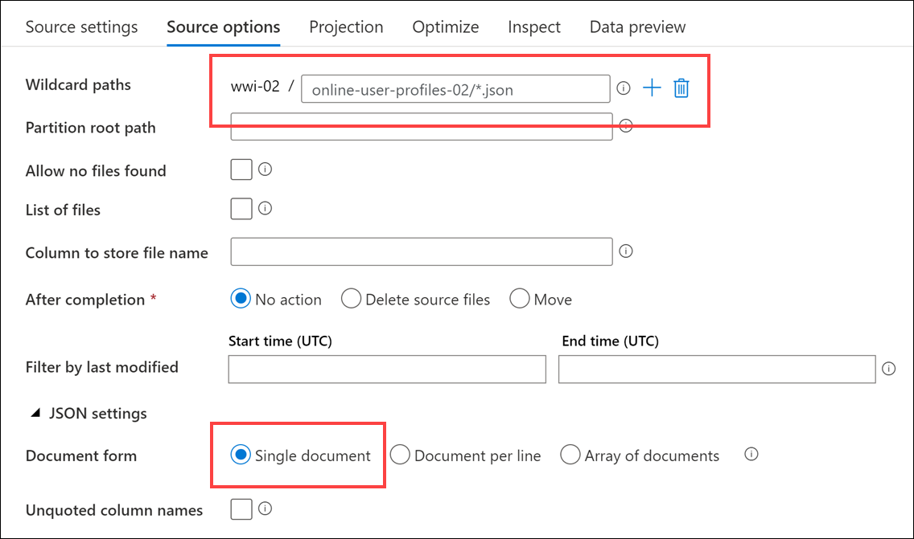
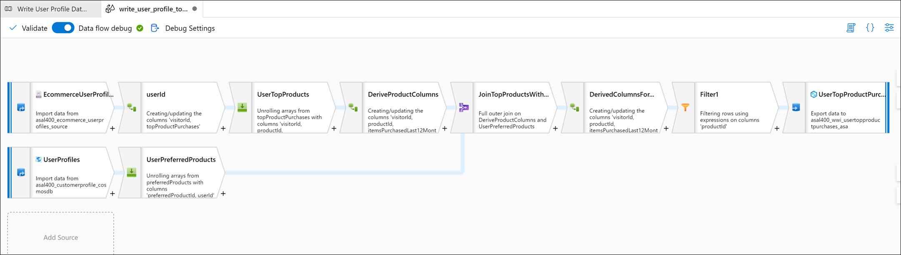

# Build automated data integration pipelines with Azure Synapse Pipelines

- [Build automated data integration pipelines with Azure Synapse Pipelines](#build-automated-data-integration-pipelines-with-azure-synapse-pipelines)
  - [Petabyte-scale ingestion with Azure Synapse Pipelines](#petabyte-scale-ingestion-with-azure-synapse-pipelines)
  - [Code-free transformation at scale with Azure Synapse Pipelines](#code-free-transformation-at-scale-with-azure-synapse-pipelines)
  - [Orchestrate data movement and transformation in Azure Synapse Pipelines](#orchestrate-data-movement-and-transformation-in-azure-synapse-pipelines)

## Petabyte-scale ingestion with Azure Synapse Pipelines

## Code-free transformation at scale with Azure Synapse Pipelines

Tailwind Traders would like code-free options for data engineering tasks. Their motivation is driven by the desire to allow junior-level data engineers who understand the data but do not have a lot of development experience build and maintain data transformation operations. The other driver for this requirement is to reduce fragility caused by complex code with reliance on libraries pinned to specific versions, remove code testing requirements, and improve ease of long-term maintenance.

Given these requirements, you recommend building Mapping Data Flows.

Mapping Data flows are pipeline activities that provide a visual way of specifying how to transform data, through a code-free experience. This feature offers data cleansing, transformation, aggregation, conversion, joins, data copy operations, etc.

Additional benefits

- Cloud scale via Spark execution
- Guided experience to easily build resilient data flows
- Flexibility to transform data per user’s comfort
- Monitor and manage data flows from a single pane of glass

1. Navigate to the **Develop** hub.

    

2. Select + then **Data flow** to create a new data flow.

    

3. In the **General** section of the **Profiles** pane of the new data flow, update the **Name** to the following: `asal400_lab2_writeuserprofiledatatoasa`.

4. Select **Add Source** on the data flow canvas.

    

5. Under **Source settings**, configure the following:

    - **Output stream name**: Enter `EcommerceUserProfiles`.
    - **Source type**: Select `Dataset`.
    - **Dataset**: Select `asal400_ecommerce_userprofiles_source`.

    

6. Select the **Source options** tab, then configure the following:

    - **Wildcard paths**: Enter `online-user-profiles-02/*.json`.
    - **JSON Settings**: Expand this section, then select the **Single document** setting. This denotes that each file contains a single JSON document.

    

<!-- 7. Select **Data preview** and select **Refresh** to display the data. Select a row under the `topProductPurchases` column to see an expanded view of the array.

     -->

1. Select the **+** to the right of the `EcommerceUserProfiles` source, then select the **Derived Column** schema modifier from the context menu.

    

2. Under **Derived column's settings**, configure the following:

    - **Output stream name**: Enter `userId`.
    - **Incoming stream**: Select `EcommerceUserProfiles`.
    - **Columns**: Provide the following information:

        | Column | Expression | Description |
        | --- | --- | --- |
        | visitorId | `toInteger(visitorId)` | Converts the `visitorId` column from a string to an integer. |

    

3. Select the **+** to the right of the `userId` step, then select the **Flatten** schema modifier from the context menu.

    

4. Under **Flatten settings**, configure the following:

    - **Output stream name**: Enter `UserTopProducts`.
    - **Incoming stream**: Select `userId`.
    - **Unroll by**: Select `[] topProductPurchases`.
    - **Input columns**: Provide the following information:

        | userId's column | Name as |
        | --- | --- |
        | visitorId | `visitorId` |
        | topProductPurchases.productId | `productId` |
        | topProductPurchases.itemsPurchasedLast12Months | `itemsPurchasedLast12Months` |

    

    These settings provide a flattened view of the data source with one or more rows per `visitorId`, similar to when you explored the data within the Spark notebook in lab 1. Using data preview requires you to enable Debug mode, which we are not enabling for this lab. *The following screenshot is for illustration only*:

    

5. Select the **+** to the right of the `UserTopProducts` step, then select the **Derived Column** schema modifier from the context menu.

    

6. Under **Derived column's settings**, configure the following:

    - **Output stream name**: Enter `DeriveProductColumns`.
    - **Incoming stream**: Select `UserTopProducts`.
    - **Columns**: Provide the following information:

        | Column | Expression | Description |
        | --- | --- | --- |
        | productId | `toInteger(productId)` | Converts the `productId` column from a string to an integer. |
        | itemsPurchasedLast12Months | `toInteger(itemsPurchasedLast12Months)` | Converts the `itemsPurchasedLast12Months` column from a string to an integer. |

    

7. Select **Add Source** on the data flow canvas beneath the `EcommerceUserProfiles` source.

    

8. Under **Source settings**, configure the following:

    - **Output stream name**: Enter `UserProfiles`.
    - **Source type**: Select `Dataset`.
    - **Dataset**: Select `asal400_customerprofile_cosmosdb`.

    

9. Since we are not using the data flow debugger, we need to enter the data flow's Script view to update the source projection. Select **Script** in the toolbar above the canvas.

    

10. Locate the **UserProfiles** `source` in the script and replace its script block with the following to set `preferredProducts` as an `integer[]` array and ensure the data types within the `productReviews` array are correctly defined:

    ```json
    source(output(
            cartId as string,
            preferredProducts as integer[],
            productReviews as (productId as integer, reviewDate as string, reviewText as string)[],
            userId as integer
        ),
        allowSchemaDrift: true,
        validateSchema: false,
        format: 'document') ~> UserProfiles
    ```

    

11. Select **OK** to apply the script changes. The data source has now been updated with the new schema. The following screenshot shows what the source data looks like if you are able to view it with the data preview option. Using data preview requires you to enable Debug mode, which we are not enabling for this lab. *The following screenshot is for illustration only*:

    

12. Select the **+** to the right of the `UserProfiles` source, then select the **Flatten** schema modifier from the context menu.

    

13. Under **Flatten settings**, configure the following:

    - **Output stream name**: Enter `UserPreferredProducts`.
    - **Incoming stream**: Select `UserProfiles`.
    - **Unroll by**: Select `[] preferredProducts`.
    - **Input columns**: Provide the following information. Be sure to **delete** `cartId` and `[] productReviews`:

        | UserProfiles's column | Name as |
        | --- | --- |
        | userId | `userId` |
        | [] preferredProducts | `preferredProductId` |

    

    These settings provide a flattened view of the data source with one or more rows per `userId`. Using data preview requires you to enable Debug mode, which we are not enabling for this lab. *The following screenshot is for illustration only*:

    

14. Now it is time to join the two data sources. Select the **+** to the right of the `DeriveProductColumns` step, then select the **Join** option from the context menu.

    

15. Under **Join settings**, configure the following:

    - **Output stream name**: Enter `JoinTopProductsWithPreferredProducts`.
    - **Left stream**: Select `DeriveProductColumns`.
    - **Right stream**: Select `UserPreferredProducts`.
    - **Join type**: Select `Full outer`.
    - **Join conditions**: Provide the following information:

        | Left: DeriveProductColumns's column | Right: UserPreferredProducts's column |
        | --- | --- |
        | `visitorId` | `userId` |

    

16. Select **Optimize** and configure the following:

    - **Broadcast**: Select `Fixed`.
    - **Broadcast options**: Check `Left: 'DeriveProductColumns'`.
    - **Partition option**: Select `Set partitioning`.
    - **Partition type**: Select `Hash`.
    - **Number of partitions**: Enter `30`.
    - **Column**: Select `productId`.

    

    <!-- **TODO**: Add optimization description. -->

17. Select the **Inspect** tab to see the join mapping, including the column feed source and whether the column is used in a join.

    

    **For illustrative purposes of data preview only:** Since we are not turning on data flow debugging, do not perform this step. In this small sample of data, likely the `userId` and `preferredProductId` columns will only show null values. If you want to get a sense of how many records contain values for these fields, select a column, such as `preferredProductId`, then select **Statistics** in the toolbar above. This displays a chart for the column showing the ratio of values.

    

18. Select the **+** to the right of the `JoinTopProductsWithPreferredProducts` step, then select the **Derived Column** schema modifier from the context menu.

    

19. Under **Derived column's settings**, configure the following:

    - **Output stream name**: Enter `DerivedColumnsForMerge`.
    - **Incoming stream**: Select `JoinTopProductsWithPreferredProducts`.
    - **Columns**: Provide the following information (_type in_ the _first two_ column names):

        | Column | Expression | Description |
        | --- | --- | --- |
        | isTopProduct | `toBoolean(iif(isNull(productId), 'false', 'true'))` | Returns `true` if `productId` is not null. Recall that `productId` is fed by the e-commerce top user products data lineage. |
        | isPreferredProduct | `toBoolean(iif(isNull(preferredProductId), 'false', 'true'))` | Returns `true` if `preferredProductId` is not null. Recall that `preferredProductId` is fed by the Azure Cosmos DB user profile data lineage. |
        | productId | `iif(isNull(productId), preferredProductId, productId)` | Sets the `productId` output to either the `preferredProductId` or `productId` value, depending on whether `productId` is null.
        | userId | `iif(isNull(userId), visitorId, userId)` | Sets the `userId` output to either the `visitorId` or `userId` value, depending on whether `userId` is null.

    

    The derived column settings provide the following result:

    

20. Select the **+** to the right of the `DerivedColumnsForMerge` step, then select the **Sink** destination from the context menu.

    

21. Under **Sink**, configure the following:

    - **Output stream name**: Enter `UserTopProductPurchasesASA`.
    - **Incoming stream**: Select `DerivedColumnsForMerge`.
    - **Dataset**: Select `asal400_wwi_usertopproductpurchases_asa`, which is the UserTopProductPurchases SQL table.
    - **Options**: Check `Allow schema drift` and uncheck `Validate schema`.

    

22. Select **Settings**, then configure the following:

    - **Update method**: Check `Allow insert` and leave the rest unchecked.
    - **Table action**: Select `Truncate table`.
    - **Enable staging**: `Check` this option. Since we are importing a lot of data, we want to enable staging to improve performance.

    

23. Select **Mapping**, then configure the following:

    - **Auto mapping**: `Uncheck` this option.
    - **Columns**: Provide the following information:

        | Input columns | Output columns |
        | --- | --- |
        | userId | UserId |
        | productId | ProductId |
        | itemsPurchasedLast12Months | ItemsPurchasedLast12Months |
        | isTopProduct | IsTopProduct |
        | isPreferredProduct | IsPreferredProduct |

    

24. Your completed data flow should look similar to the following:

    

25. Select **Publish all** to save your new data flow.

    

## Orchestrate data movement and transformation in Azure Synapse Pipelines
